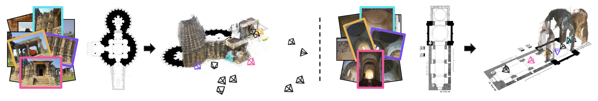
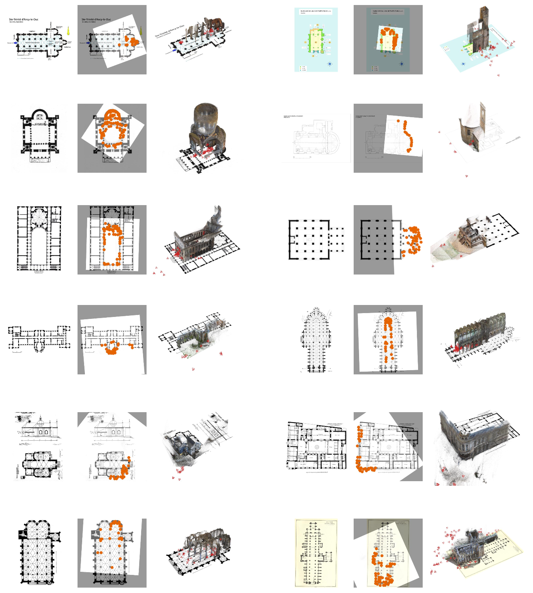

# SceneAligner: 3D-Grounded Floorplan Localization in the Wild

### [Paper](https://arxiv.org/abs/2605.22581) | [Project Page](https://Cornell-VAILab.github.io/SceneAligner)

> Given a collection of in-the-wild images and a rasterized floorplan, SceneAligner reconstructs a gravity-aligned 3D point cloud from the images and globally aligns this reconstruction to the 2D floorplan map, thereby localizing the images within the floorplan. As illustrated above, our approach successfully aligns images capturing large-scale 3D environments, including exterior scenes (Doddabasappa Temple, left) and interior spaces (Église Saint-Martin d’Agonac, right).

## Release
Code and data will be publicly available.
