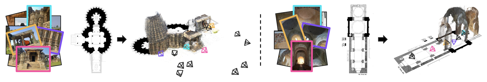
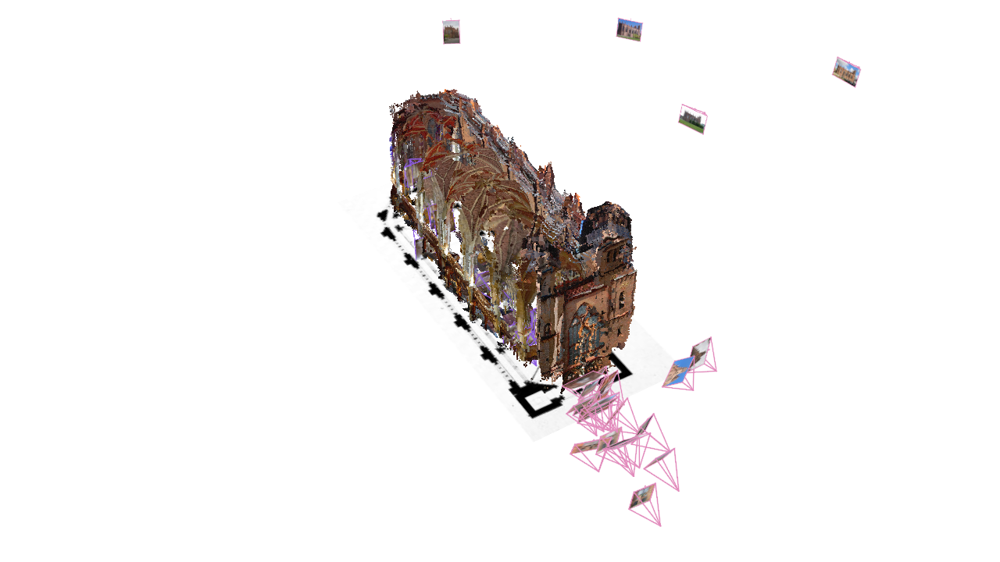

# [NeurIPS'26] SceneAligner: 3D-Grounded Floorplan Localization in the Wild

### [Paper](https://arxiv.org/abs/2605.22581) | [Project Page](https://Cornell-VAILab.github.io/SceneAligner)


> Given a collection of in-the-wild images and a rasterized floorplan, SceneAligner reconstructs a gravity-aligned 3D point cloud from the images and globally aligns this reconstruction to the 2D floorplan map, thereby localizing the images within the floorplan. As illustrated above, our approach successfully aligns images capturing large-scale 3D environments, including exterior scenes (Doddabasappa Temple, left) and interior spaces (Église Saint-Martin d’Agonac, right).

## Installation

```bash
conda create -n scenealigner python=3.11
conda activate scenealigner
pip install torch==2.7.1 torchvision==0.22.1 --index-url https://download.pytorch.org/whl/cu126
pip install -r requirements.txt
```

Optional, to render images of the 3D viewer without a browser (`--render`):

```bash
pip install playwright && playwright install chromium
```

## Demo

The example is the Friedrichswerder Church in Berlin from the [C3 dataset](https://c3po-correspondence.github.io/):
20 interior and 40 exterior photos, which share one floorplan.

```bash
python demo.py --images examples/S221/interior examples/S221/exterior --floorplan examples/S221/floorplan.jpg --output outputs/S221
```

Each directory is a photo collection, reconstructed and aligned to the floorplan independently; collections without visual overlap thus end up in a common frame. Collections of more than 150 photos are split into several reconstructions. For each reconstruction, the demo saves the floorplan-aligned 3D scene (`.npz`), the density map and its alignment with the reliable correspondences, and it draws the cameras on the floorplan (`cameras.png`). It then starts the 3D viewer at http://localhost:8080. With `--share`, the viewer is also served at a public viser share URL, valid for 24 hours.

```bash
python -m scenealigner.viewer outputs/S221                                # interactive viewer
python -m scenealigner.viewer outputs/S221 --render first_frame.png       # image of the first-frame view
python -m scenealigner.viewer outputs/S221 --render demo.png --angle 270  # image after a 270° turn of the turntable
```


> View of the example after a 270° turn of the viewer's turntable.

## Dataset

We use a clean subset of [C3](https://c3po-correspondence.github.io/). Its test split is listed in `data/c3/test.csv` and its train split in `train.csv` of our [dataset repository](https://huggingface.co/datasets/jhcho99/SceneAligner):

| Column | Description |
|---|---|
| `uid` | Identifier of the photo-floorplan pair in C3 |
| `scene_id` | `S<scene>-<I or E>-F<floorplan>`: interior (I) or exterior (E) photos of a scene, paired with a floorplan |
| `chunk_idx` | Test only: reconstruction the photo belongs to (scenes of more than 150 photos are split) |
| `scene_name`, `plan_path`, `photo_path` | As in C3; paths are relative to `<C3>/visual/<scene_name>/` |
| `type` | `interior` or `exterior` |

Download [C3](https://huggingface.co/datasets/kwhuang/C3) (427 GB) and extract its archives (the evaluation only needs `geometric/geometric_test.tar.gz` and the `visual/` archives of the test scenes, 58 GB):

```bash
hf download kwhuang/C3 --repo-type dataset --local-dir <C3>
(cd <C3>/geometric && for f in *.tar.gz; do tar -xzf "$f"; done)
(cd <C3>/visual && for f in *.tar.gz; do tar -xzf "$f"; done)
```

The dataset repository (52 GB) also holds our cached test data: the π³ reconstructions of the test photos (with the scene gravity from GeoCalib), their density maps, and the GeoCalib gravity of each photo:

```bash
hf download jhcho99/SceneAligner --repo-type dataset --local-dir <cache>
```

## Evaluation

On our cached reconstructions, which reproduces Tables 1 and 2 of the paper up to small numerical differences between GPUs:

```bash
python evaluate_c3.py --c3_root <C3> --recon_cache <cache>/test/reconstructions                               # Ours
python evaluate_c3.py --c3_root <C3> --recon_cache <cache>/test/reconstructions --checkpoint_dir pre-trained  # pretrained DINOv3
```

End to end from the photos, with the public π³ weights of MegaDepth-X; the numbers may differ slightly:

```bash
python evaluate_c3.py --c3_root <C3>
```

## Release
- [x] Demo, inference and evaluation on C3, with the model checkpoint ([jhcho99/SceneAligner](https://huggingface.co/jhcho99/SceneAligner)), the dataset and the cached test data
- [ ] Training on C3 and training data generation
- [ ] Structured3D

## License
The code is released under the [MIT License](LICENSE). The models and data it uses keep their own licenses, listed in [THIRD_PARTY.md](THIRD_PARTY.md); the π³ weights are for non-commercial use only.

## Citation
If you find our work useful for your research, please cite our paper:

````BibTeX
@inproceedings{cho2026scenealigner,
  title={SceneAligner: 3D-Grounded Floorplan Localization in the Wild},
  author={Junhyeong Cho and Ruojin Cai and Hadar Averbuch-Elor},
  booktitle={Advances in Neural Information Processing Systems (NeurIPS)},
  year={2026}
}
````